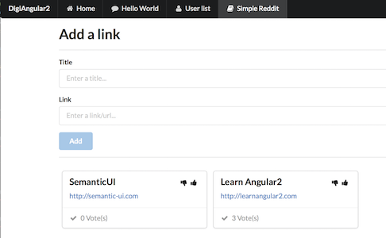
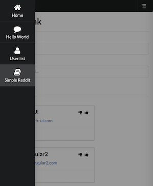

# Digiangular2

Project that uses:
* __Semantic UI / ngSemantic__
* __TypeScript__
* __Angular2__
* __Express__ to simulate a simple REST API with Web Token authentication

This project was generated with [angular-cli](https://github.com/angular/angular-cli) version 1.0.0-beta.24.

### On desktop

### On mobile (with sidebar)


## Content
* __Home__ -- Display static test.
* __Menu Component__ -- Users an array of JSON object to generate a Desktop menu and a Mobile sidebar / hamburger menu.
* __HelloWorld__ -- Mandatory (?) exercise.
* __User Item__ -- Define a component ```<app-user-item name=''></app-user-item>``` that display a name.
* __User List__ -- Loop through an array and display a series of ```<app-user-item>```.
* __Simple Reddit__ -- Add article with form validation and basic voting.
* __REST API__ -- In the ```server``` directory, you can launch your API server using ```node index.js```. ```http://localhost:3000/api``` points to the API, ```/api/authenticate``` to login, and ```/api/resources``` needs a valid token.
* __Protected Content__ -- Uses token on the server side and canActivate on the client. On the client, this is more about navigation than security; the API provides the security.

## Prerequisites
```bash
$ sudo npm install -g angular-cli
```

## Install
```bash
$ npm install
```
During the install,
* select 'Yes, extend my current settings.',
* then 'Automatic'
* then 'Yes'
* Then press Enter.

## Start (Dev)
```bash
$ ng serve
```
Navigate to `http://localhost:4200/`. The app will automatically reload if you change any of the source files.

If you want to use the REST API and login page and protected content, start the REST API:
```bash
$ node server/index.js
```


## To add component

Run `ng generate component component-name` to generate a new component. You can also use `ng generate directive/pipe/service/class/module`.
